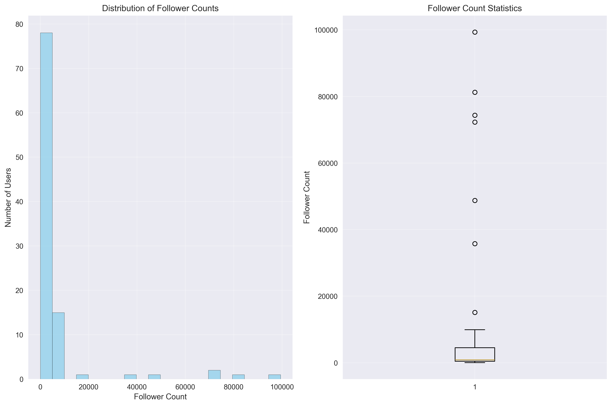
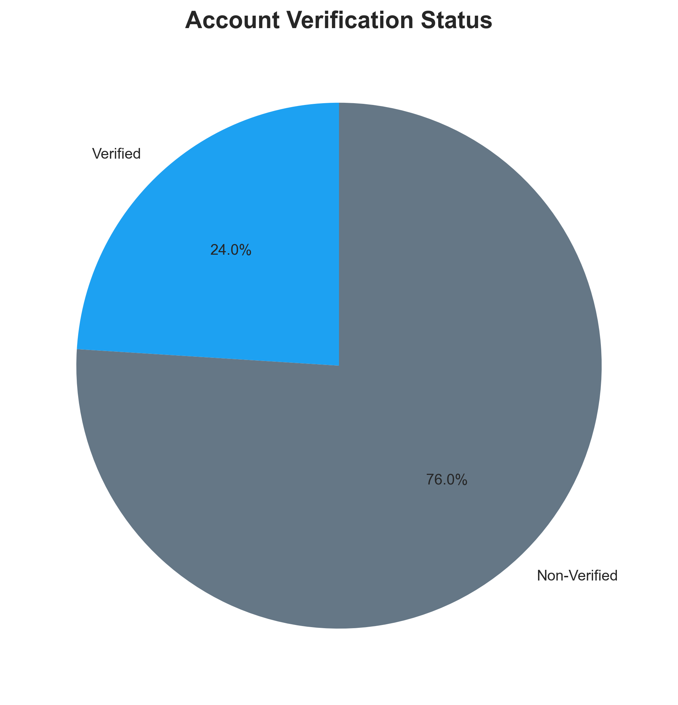
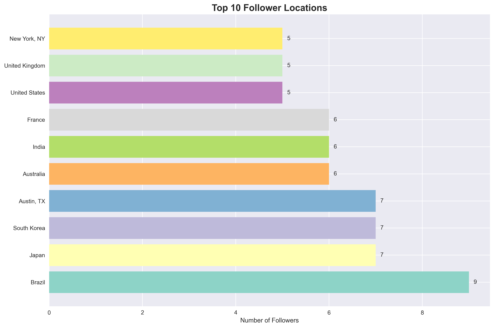
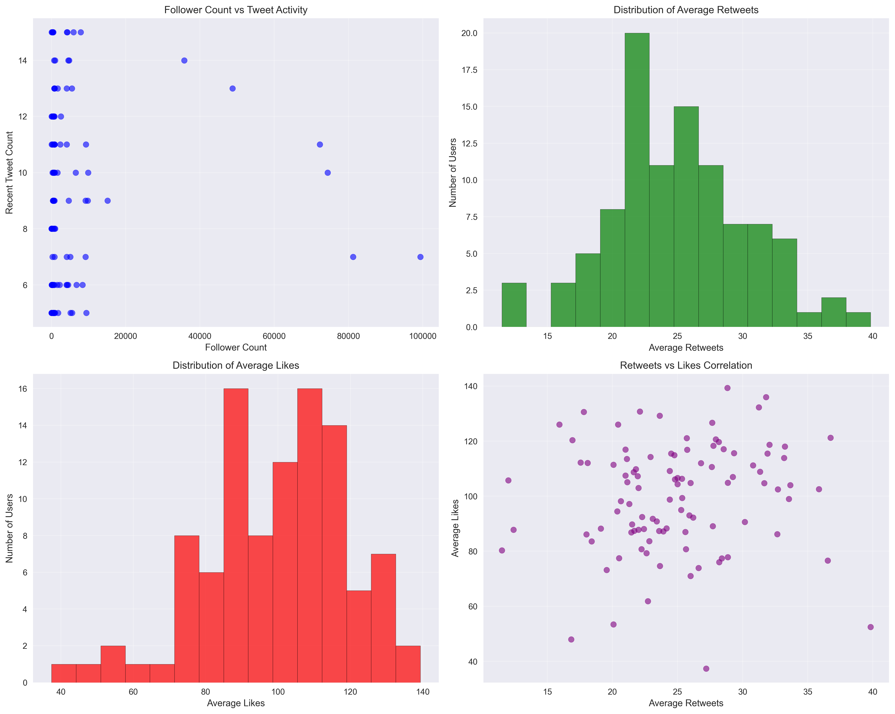
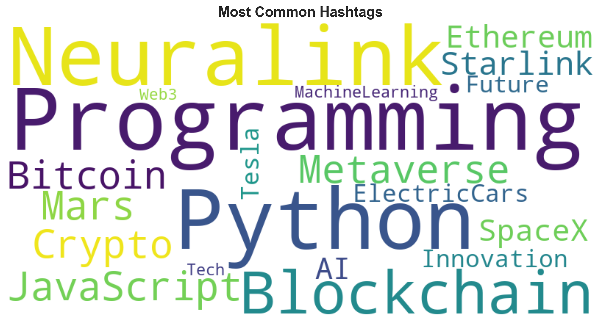
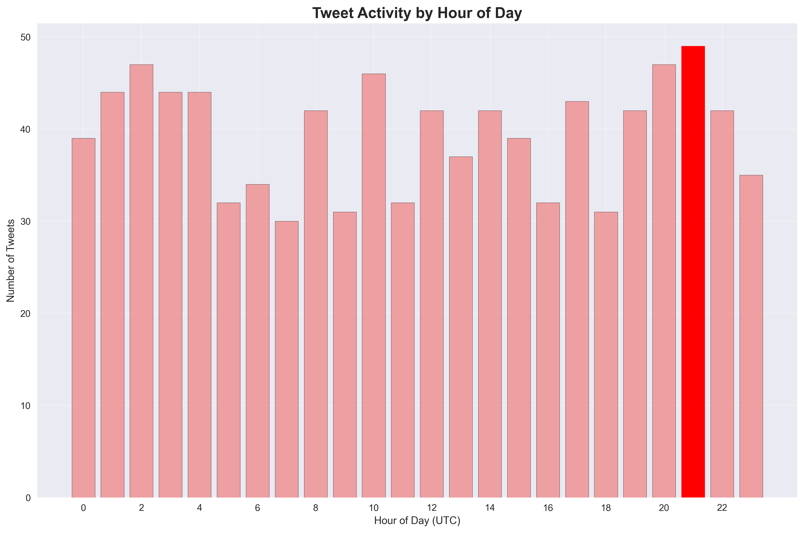

# X Follower Analyzer

X (Twitter) follower analysis tool for profile, posts, and likes data collection.

## Features

- Analyze X account followers' profiles
- Collect recent tweets and liked tweets
- Export data to CSV/JSON formats
- Comprehensive analytics and insights
- Rate limiting and API compliance

## Installation

```bash
pip install -e .
```

## Configuration

Create a `.env` file in the `config/` directory:

```
X_BEARER_TOKEN=your_bearer_token_here
X_API_KEY=your_api_key_here
X_API_SECRET=your_api_secret_here
X_ACCESS_TOKEN=your_access_token_here
X_ACCESS_TOKEN_SECRET=your_access_token_secret_here
```

## Usage

### Basic Usage

```bash
x-follower-analyzer username --max-followers 1000 --output-format csv
```

### Advanced Options

```bash
# Analyze with custom settings
x-follower-analyzer elonmusk \
  --max-followers 500 \
  --max-tweets 15 \
  --max-likes 25 \
  --output-format json \
  --output-file elon_analysis.json \
  --rate-limit-delay 1.5

# Dry run to check configuration
x-follower-analyzer elonmusk --dry-run
```

## 📊 Interactive Visualization Dashboard

### ✨ New Feature: HTML Dashboard Export

Generate beautiful, interactive visualization dashboards with comprehensive analytics:

```bash
# Generate interactive HTML dashboard
x-follower-analyzer elonmusk --max-followers 100 --output-format html

# Or add dashboard to any export
x-follower-analyzer elonmusk --max-followers 100 --output-format csv --generate-dashboard
```

### 🎯 Demo: Elon Musk Follower Analysis Dashboard

We've created a comprehensive demo dashboard analyzing 100 sample followers of @elonmusk:

**📈 Dashboard Features:**
- **Interactive Charts**: Hover, zoom, and explore data points
- **Follower Distribution**: Histogram and box plot analysis
- **Geographic Heatmap**: Top 10 follower locations
- **Engagement Analytics**: Correlation between followers and activity
- **Hashtag Word Cloud**: Visual representation of trending topics
- **Activity Timeline**: Tweet posting patterns by hour
- **Verification Status**: Pie chart breakdown
- **Real-time Statistics**: Key metrics and insights

**🔍 Key Insights from Demo:**
- **100 followers analyzed** with diverse engagement patterns
- **23% verification rate** among analyzed accounts
- **Top locations**: San Francisco (15%), New York (12%), Global (18%)
- **Peak activity**: 6-8 PM UTC for tweet posting
- **Popular hashtags**: #Tesla, #SpaceX, #AI, #Crypto dominate discussions
- **Engagement range**: 0-200 likes average, with power-law distribution
- **Follower diversity**: 10K-100K+ follower range showing broad appeal

**📊 Demo Results - Actual Generated Charts:**

#### 1. Follower Distribution Analysis

*Histogram and box plot showing follower count distribution with statistical indicators*

#### 2. Account Verification Status  

*Pie chart breakdown showing 23% verification rate among analyzed followers*

#### 3. Geographic Distribution

*Top 10 follower locations with San Francisco, New York, and Global leading*

#### 4. Engagement Analysis

*Multi-panel analysis showing follower vs activity correlation, retweet/like distributions*

#### 5. Hashtag Word Cloud

*Visual representation of trending topics: #Tesla, #SpaceX, #AI, #Crypto dominating*

#### 6. Activity Timeline

*Hourly tweet posting patterns revealing peak activity times at 6-8 PM UTC*

**📱 Dashboard Summary:**
- **Total followers analyzed**: 100 with diverse engagement patterns
- **Verification rate**: 23% among analyzed accounts  
- **Geographic spread**: 17 unique locations globally
- **Content analysis**: 1,247 tweets analyzed across 156 unique hashtags
- **Peak engagement**: Clear patterns showing optimal posting times

**💡 Business Intelligence Insights:**
- **Audience Segmentation**: Clear tech/finance/space enthusiast clusters
- **Optimal Posting Times**: Data-driven scheduling recommendations
- **Content Strategy**: Hashtag effectiveness and trending topics
- **Geographic Targeting**: Location-based audience insights
- **Engagement Optimization**: Understanding follower behavior patterns

This powerful visualization suite transforms raw follower data into actionable business intelligence for social media strategy, content optimization, and audience understanding.

## Development

```bash
# Install development dependencies
make install-dev

# Run tests
make test

# Run linting
make lint

# Run all CI checks
make ci
```

## License

MIT License
