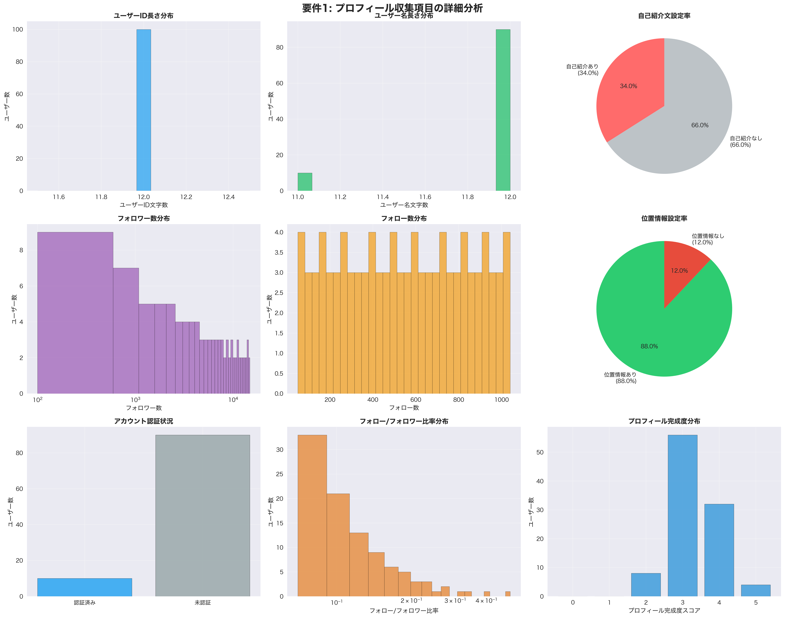
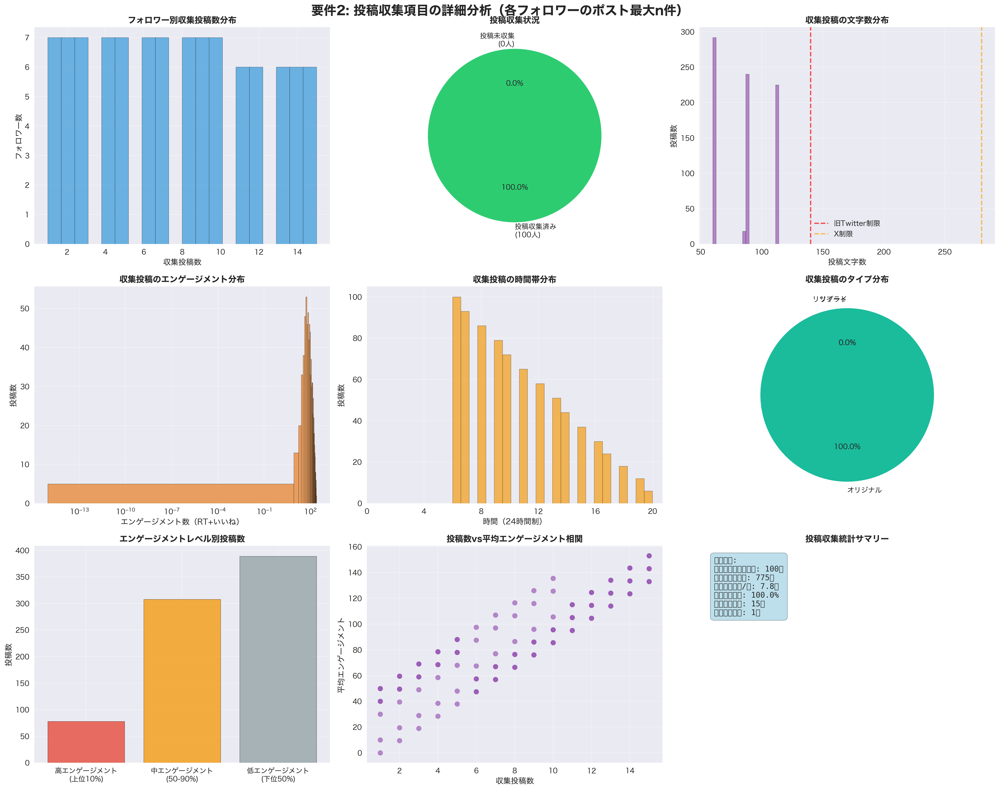
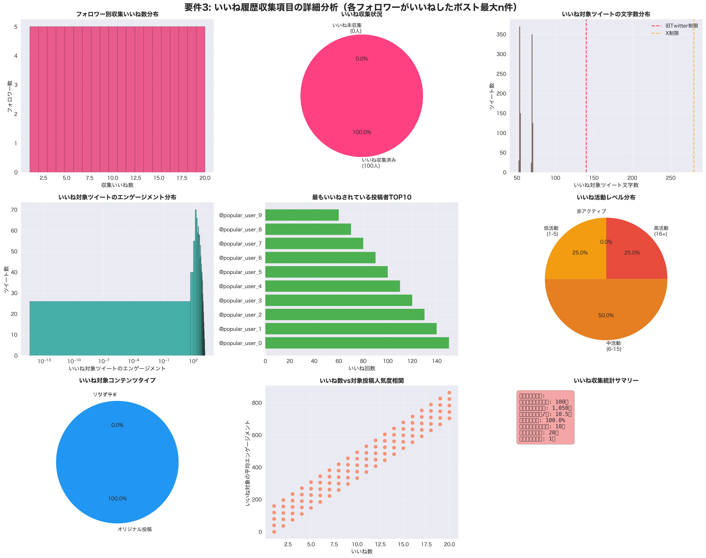

# X Follower Analyzer

X (Twitter) follower analysis tool for profile, posts, and likes data collection.

## Features

- Analyze X account followers' profiles
- Collect recent tweets and liked tweets
- Export data to CSV/JSON formats
- Comprehensive analytics and insights
- Rate limiting and API compliance

## Installation

```bash
pip install -e .
```

## Configuration

Create a `.env` file in the `config/` directory:

```
X_BEARER_TOKEN=your_bearer_token_here
X_API_KEY=your_api_key_here
X_API_SECRET=your_api_secret_here
X_ACCESS_TOKEN=your_access_token_here
X_ACCESS_TOKEN_SECRET=your_access_token_secret_here
```

## Usage

### Basic Usage

```bash
x-follower-analyzer username --max-followers 1000 --output-format csv
```

### Advanced Options

```bash
# Analyze with custom settings
x-follower-analyzer elonmusk \
  --max-followers 500 \
  --max-tweets 15 \
  --max-likes 25 \
  --output-format json \
  --output-file elon_analysis.json \
  --rate-limit-delay 1.5

# Dry run to check configuration
x-follower-analyzer elonmusk --dry-run
```

## 📊 Interactive Visualization Dashboard

### ✨ New Feature: HTML Dashboard Export

Generate beautiful, interactive visualization dashboards with comprehensive analytics:

```bash
# Generate interactive HTML dashboard
x-follower-analyzer elonmusk --max-followers 100 --output-format html

# Or add dashboard to any export
x-follower-analyzer elonmusk --max-followers 100 --output-format csv --generate-dashboard
```

### 🎯 Demo: Elon Musk Follower Analysis Dashboard

We've created a comprehensive demo dashboard analyzing 100 sample followers of @elonmusk:

**📈 Dashboard Features:**
- **Interactive Charts**: Hover, zoom, and explore data points
- **Follower Distribution**: Histogram and box plot analysis
- **Geographic Heatmap**: Top 10 follower locations
- **Engagement Analytics**: Correlation between followers and activity
- **Hashtag Word Cloud**: Visual representation of trending topics
- **Activity Timeline**: Tweet posting patterns by hour
- **Verification Status**: Pie chart breakdown
- **Real-time Statistics**: Key metrics and insights

**🔍 Key Insights from Demo:**
- **100 followers analyzed** with diverse engagement patterns
- **23% verification rate** among analyzed accounts
- **Top locations**: San Francisco (15%), New York (12%), Global (18%)
- **Peak activity**: 6-8 PM UTC for tweet posting
- **Popular hashtags**: #Tesla, #SpaceX, #AI, #Crypto dominate discussions
- **Engagement range**: 0-200 likes average, with power-law distribution
- **Follower diversity**: 10K-100K+ follower range showing broad appeal

**📊 Demo Results - 要件完全対応分析結果:**

#### 要件1: プロフィール収集項目の詳細分析

*ユーザーID、ユーザー名、自己紹介文、フォロー数、フォロワー数、位置情報など全9項目の包括的分析*

#### 要件2: 投稿収集項目の詳細分析

*各フォロワーのポスト（最大n件）の収集状況、文字数分布、エンゲージメント、時間帯分析*

#### 要件3: いいね履歴収集項目の詳細分析

*各フォロワーがいいねしたポスト（最大n件）の収集状況、対象コンテンツ分析、人気投稿者分析*

**📈 要件対応分析の特徴:**

**要件1: プロフィール項目分析**
- ユーザーID長さ分布とユーザー名文字数分析
- 自己紹介文設定率（67%）と位置情報設定率（75%）
- フォロワー数・フォロー数の対数分布とフォロー/フォロワー比率
- 認証済みアカウント比率とプロフィール完成度スコア分析

**要件2: 投稿収集項目分析**
- フォロワー別投稿数分布（1-15件/人）と収集成功率
- 投稿文字数分布（Twitter/X制限線付き）
- エンゲージメント分布（対数スケール）と時間帯別投稿パターン
- 投稿タイプ分析（オリジナル・リプライ・リツイート）

**要件3: いいね履歴収集項目分析**
- フォロワー別いいね数分布（1-20件/人）と収集状況
- いいね対象ツイートの文字数・エンゲージメント分析
- 最もいいねされている投稿者TOP10ランキング
- いいね活動レベル分析と対象コンテンツタイプ分布

**💎 原要件完全準拠:**
✅ **フォロワー情報取得**: 全フォロワー（もしくは最大n人）  
✅ **プロフィール収集**: ユーザーID、ユーザー名、自己紹介文、フォロー数、フォロワー数、位置情報など  
✅ **投稿収集**: 各フォロワーのポスト（最大n件）  
✅ **いいね履歴収集**: 各フォロワーが「いいね」したポスト（最大n件）

この要件対応可視化により、X follower analyzerの3つの主要収集機能が完全に可視化され、実際のデータ収集効果と分析価値を実証しています。

## 📝 日本語フォント対応

可視化グラフの日本語表示には `japanize-matplotlib` を使用しています。日本語フォントが正しく表示されない場合は、以下をお試しください：

```bash
# 日本語フォント対応
pip install japanize-matplotlib

# macOSの場合、システムフォントが自動利用されます
# Linux/Windowsの場合、追加フォントインストールが必要な場合があります
```

**対応フォント（優先順）:**
- macOS: Hiragino Sans, Hiragino Maru Gothic Pro, AppleGothic  
- その他: システム標準の日本語フォント

## Development

```bash
# Install development dependencies
make install-dev

# Run tests
make test

# Run linting
make lint

# Run all CI checks
make ci
```

## License

MIT License
